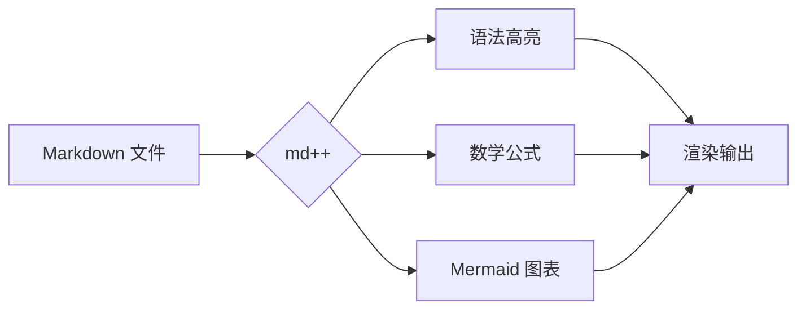
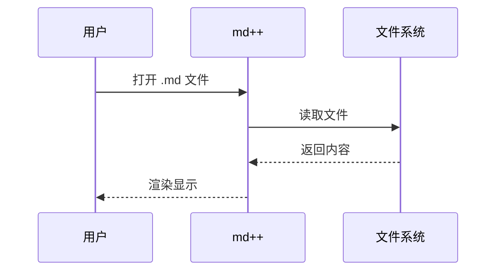

# md++ 渲染特性展示

本文档展示 md++ 支持的全部 Markdown 渲染特性。详细用法请参考各章节说明。

---

## 基础语法

### 标题

# 一级标题
## 二级标题
### 三级标题
#### 四级标题
##### 五级标题
###### 六级标题

### 文本样式

- **粗体文字**
- *斜体文字*
- ~~删除线~~
- ==高亮标记==
- `行内代码`

### 列表

1. 有序列表项 1
2. 有序列表项 2
   - 嵌套无序列表
   - 另一项
3. 有序列表项 3

- [x] 已完成任务
- [ ] 待办任务
- [x] 另一项已完成

### 引用

> 这是一段引用文字。引用可以嵌套：
> > 这是嵌套引用。

### 表格

| 功能 | 状态 | 说明 |
|------|------|------|
| 基础语法 | ✅ | 全面支持 |
| 数学公式 | ✅ | KaTeX 渲染 |
| 图表 | ✅ | Mermaid 渲染 |

### 分割线

---

## 链接与图片

### 智能链接

- 外链：[GitHub](https://github.com) — 使用系统浏览器打开
- 内链：[跳转到特性章节](#扩展语法) — 页面内平滑滚动
- MD 文件：[README](README.md) — 新标签页打开

### 图片


图片点击可灯箱放大，按 `+`/`-` 缩放，`ESC` 关闭。

---

## 扩展语法

### GitHub 风格警报

> [!NOTE]
> 这是一个 **NOTE** 提示框，用于提供一般性信息。

> [!TIP]
> 这是一个 **TIP** 提示框，用于分享实用技巧。

> [!IMPORTANT]
> 这是一个 **IMPORTANT** 提示框，用于强调关键事项。

> [!WARNING]
> 这是一个 **WARNING** 提示框，用于提醒潜在风险。

> [!CAUTION]
> 这是一个 **CAUTION** 提示框，用于警告危险操作。

### 自定义容器

::: tip 快速上手
tip 容器用于分享技巧和建议。
:::

::: info 补充说明
info 容器用于展示补充信息。
:::

::: note 注意事项
note 容器用于记录重要笔记。
:::

::: warning 性能警告
warning 容器用于提醒注意事项。
:::

::: caution 数据安全
caution 容器用于强调危险操作。
:::

### 折叠详情

::: details 点击展开查看示例代码
这里是折叠起来的详细内容，可以包含任意 Markdown：

- 列表
- **粗体**
- `代码`

```js
console.log('Hello from details!');
```
:::

---

## 代码增强

### 语法高亮

```rust
fn main() {
    let msg = "Hello, md++!";
    println!("{}", msg);
}
```

### 代码块标题

```js title="hello.js"
function greet(name) {
  console.log(`Hello, ${name}!`);
}
greet('World');
```

### 行号

代码超过两行自动显示行号（左侧灰色数字）。

### 代码行标记

```python title="demo.py"
def process(data):
    result = []          # [!code highlight]
    for item in data:
        if item > 0:     # [!code focus]
            result.append(item * 2)  # [!code ++]
        else:
            result.append(0)         # [!code --]
    return result
```

- `[!code highlight]` — 黄色高亮当前行
- `[!code ++]` — 绿色新增标记
- `[!code --]` — 红色删除标记
- `[!code focus]` — 聚焦当前行

### 一键复制

鼠标悬停代码块，右上角出现「复制」按钮。

---

## 数学公式（KaTeX）

### 行内公式

质能方程：$E = mc^2$

勾股定理：$a^2 + b^2 = c^2$

### 块级公式

$$
\int_{-\infty}^{\infty} e^{-x^2} dx = \sqrt{\pi}
$$

$$
\begin{bmatrix}
1 & 2 & 3 \\
4 & 5 & 6 \\
7 & 8 & 9
\end{bmatrix}
$$

---

## 图表（Mermaid）

### 流程图



### 序列图



---

## 其他扩展

### 上标与下标

- 上标：x^2^ + y^2^ = z^2^
- 下标：H~2~O 是水的化学式
- 脚注示例：[^1]

[^1]: 脚注内容会出现在页面底部。

### Emoji 短码

- 表情：:smile: :heart: :+1: :tada: :fire: :star:
- 符号：:warning: :white_check_mark: :x: :question:
- 编程：:rocket: :sparkles: :bug: :memo:

### 缩写

md++ 支持 HTML 和 CSS 的缩写展示。

*[HTML]: Hyper Text Markup Language
*[CSS]: Cascading Style Sheets

将鼠标悬停在「HTML」或「CSS」上查看缩写定义。

---

## 综合示例

::: tip 最佳实践
结合多种语法可以写出结构清晰的 Markdown 文档。
:::

### 项目结构

```
md++/
├── src/          # 前端源码
├── src-tauri/    # Rust 后端
└── docs/         # 项目文档
```

### 性能数据

| 指标 | 数值 | 状态 |
|------|------|------|
| 冷启动 | < 1s | ✅ |
| 大文件(1MB) | < 500ms | ✅ |
| 内存占用 | ~50MB | ✅ |

> [!IMPORTANT]
> 以上为开发环境测试数据，实际表现因系统差异可能略有不同。

$$
\text{性能指数} = \frac{\text{用户体验}}{\text{资源消耗}} \times 100\%
$$
